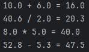

# Java Swing Calculator

This project is a simple calculator application built using Java Swing.

## Features

- Basic arithmetic operations:
  - Addition (+)
  - Subtraction (-)
  - Multiplication (*)
  - Division (/)
- Decimal number support (floating point operations)
- Clear function (reset the calculation)
- Simple and intuitive user interface
- Error handling for basic edge cases
